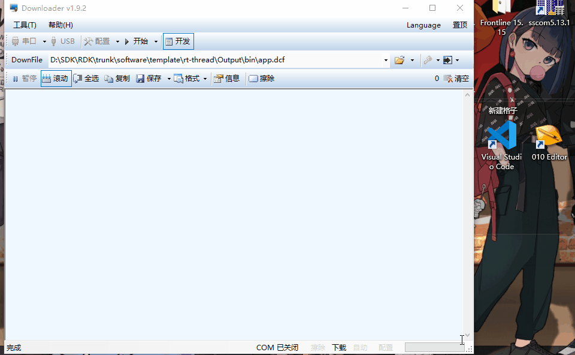
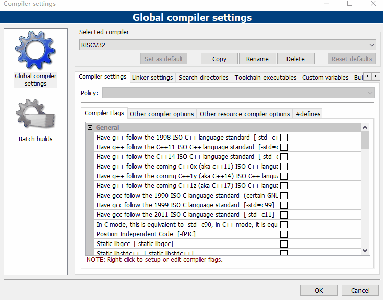
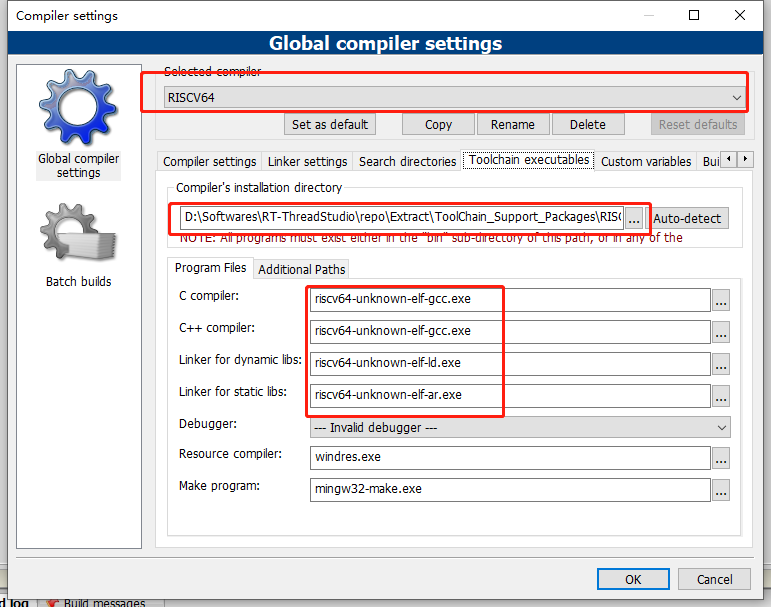

==========
开始之前
==========

获取 SDK
==========

`bluetrum_sdk <https://github.com/BLUETRUM/bluetrum_sdk>`_

开发软件安装
=================

工具链
----------
SDK 使用的是 `riscv64-unknown-elf-` 工具链，获取途径

+ 从源码编译 `riscv-gnu-toolchain <https://github.com/riscv/riscv-gnu-toolchain>`_
+ 从 `rt-thread studio <https://www.rt-thread.org/page/studio.html>`_ 中获取，工具链在 studio 的 `RT-ThreadStudio/repo/Extract/ToolChain_Support_Packages/RISC-V/RISC-V-GCC/10.1.0/bin` 目录下

需要将工具链配置到系统环境变量中

IDE 安装
-----------
`Code::Blocks <http://www.codeblocks.org/>`_

固件下载软件
-------------
`downloader <https://github.com/BLUETRUM/Downloader>`_

找到项目对应的 `.zip` 包下载，解压后就可以看到 `downloader`

使用时，需要选择对应的串口，选择需要下载的 `.dcf`，点击下载即可

开发软件使用说明
=================

配置软件
------------
`Setting->Compiler` 打开编译器设置
点击 `Copy` 新建一个选项，然后命名为 `RISVC64`。`RISVC64` 已经存在的话，可以不用再添加，参考下面的步骤，更改工具链的地址

配置工具链，注意路径不要出错

如何编译程序
------------

双击打开 `template/rt-thread/app.cbp` 工程文件

点击工具栏的编译按键

如何下载固件
------------

